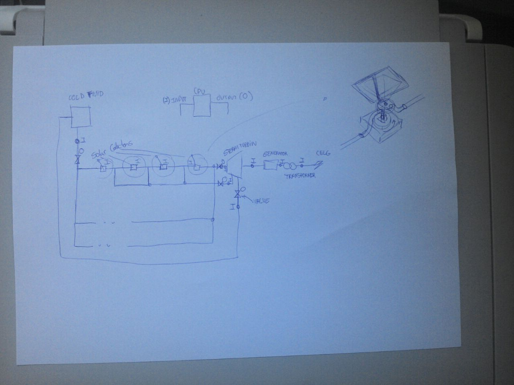

# h3
H³ - Heliothermic Harvest Heater

### Description

This project is based on a multitude of [resources and concepts](/links-resources.txt).

### "First" Draft

There was very different drafts, previous to this one. They're were designed as part as another project, [arvore-de-vidro](https://github.com/arthurmoises/arvore-de-vidro) (portuguese only), but to make things new, this will be considered the "H³ First Draft":

The main goal is to develop a solar colector capable of generating heat and steam in a modular fashion.  

### LICENSE

CERN Open Hardware Licence v1.2.
